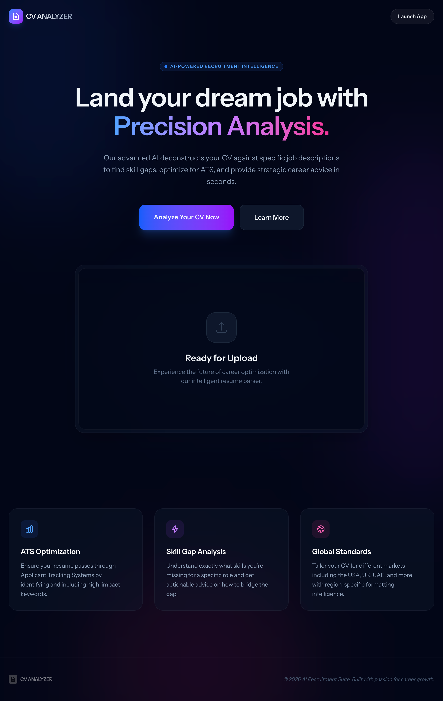

# AI CV Analyzer 🚀

A professional-grade, AI-powered tool designed to analyze CVs and Resumes against specific Job Descriptions. It provides deep insights into ATS compatibility, skill gaps, and regional formatting standards using local AI processing.

## 📸 Screenshots


*Modern Landing Page*


*Comprehensive CV Analyzer Form*


*Detailed, Color-Coded Analysis Report*

## ✨ Features

-   **Deep AI Analysis**: Leverages Ollama (local AI) to provide detailed, constructive feedback without sending sensitive data to the cloud.
-   **Dual File Support**: Fully supports both **PDF** and **DOCX** formats with optimized text extraction.
-   **ATS Optimization**: Identifies missing keywords and formatting issues that might hinder ATS parsing.
-   **Semantic Reporting**: Reports are color-coded (Green/Red) to highlight strengths and critical gaps instantly.
-   **Personalized Headers**: Generates professional reports with custom "Prepared for" and "Prepared by" headers.
-   **Background Processing**: Uses Laravel Queues to handle heavy AI tasks asynchronously, ensuring a responsive user experience.
-   **Premium UI/UX**: Built with a sleek, dark-themed "glassmorphism" interface using Vue 3 and Tailwind CSS.

## 🛠️ Tech Stack

-   **Backend**: Laravel 12, PHP 8.2+
-   **Frontend**: Vue 3, Inertia.js, Tailwind CSS
-   **AI Engine**: Ollama (Running locally)
-   **Database**: MySQL / SQLite
-   **Tools**: Wayfinder (for type-safe routing), `PDFParser`, and Custom Word Extractor.

## 🚀 Getting Started

### Prerequisites

-   PHP 8.2+ & Composer
-   Node.js & NPM
-   [Ollama](https://ollama.ai/) installed and running.

### Installation

1.  **Clone the repository**:
    ```bash
    git clone https://github.com/shazimali/ai-powered-cv-analyzer.git
    cd ai-powered-cv-analyzer
    ```

2.  **Install PHP dependencies**:
    ```bash
    composer install
    ```

3.  **Install JS dependencies**:
    ```bash
    npm install
    ```

4.  **Environment Setup**:
    ```bash
    cp .env.example .env
    php artisan key:generate
    ```

5.  **Configure AI**:
    Ensure your Ollama server is running and pull the required model (default: `gemma2:9b` or similar as specified in `.env`):
    ```bash
    ollama pull gemma2:9b
    ```

6.  **Run Migrations**:
    ```bash
    php artisan migrate
    ```

7.  **Start the Application**:
    ```bash
    # In terminal 1 (Vite)
    npm run dev

    # In terminal 2 (Web Server)
    php artisan serve

    # In terminal 3 (Queue Worker - CRITICAL for Analysis)
    php artisan queue:work
    ```

## 📈 Usage

1.  Navigate to the landing page.
2.  Click **"Go to Analyzer"**.
3.  Upload your CV (PDF or DOCX).
4.  Paste the Job Description and fill in the Target Company/Details.
5.  Wait for the AI to process (this usually takes 1-2 minutes for deep analysis).
6.  View your professional, color-coded analysis report!

## 📄 License

The Laravel framework is open-source software licensed under the [MIT license](https://opensource.org/licenses/MIT).
